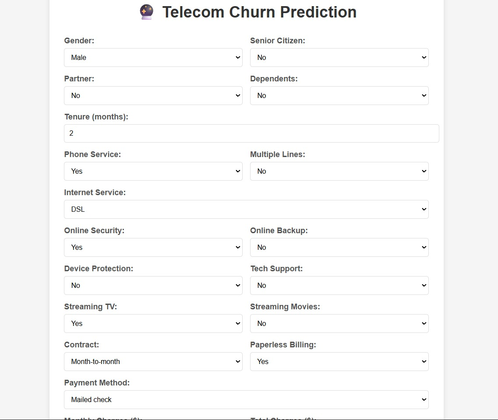
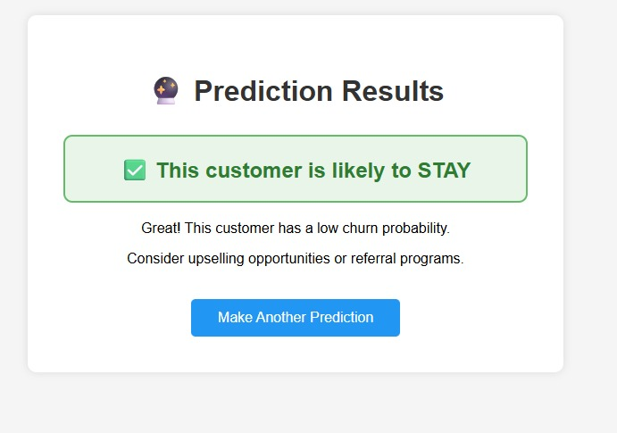
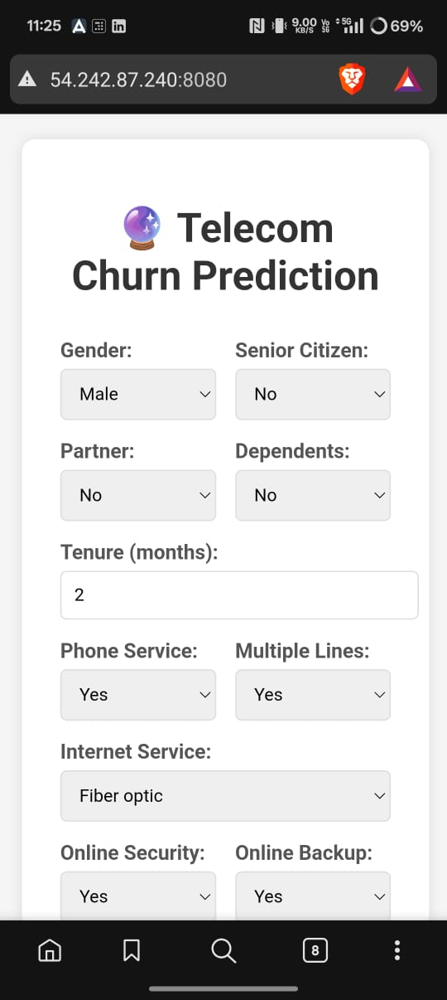
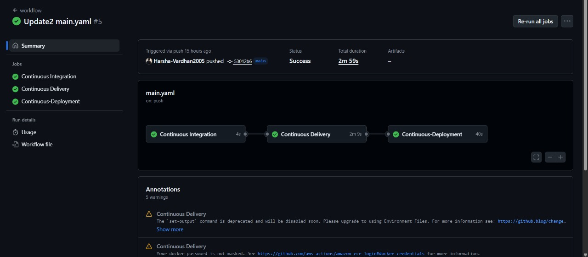

# 📡 Telecom Customer Churn Prediction - MLOps Project


## 🎯 Project Overview

This project implements an **end-to-end MLOps pipeline** for predicting customer churn in the telecommunications industry. The system uses machine learning to identify customers likely to cancel their services, enabling proactive retention strategies.

### ✨ Key Features
- **🤖 Machine Learning Model**: ~80% accuracy churn prediction
- **📊 MLflow Integration**: Complete experiment tracking and model management
- **🐳 Containerized Deployment**: Docker-based application packaging
- **☁️ Cloud Infrastructure**: Deployed on AWS (ECR + EC2)
- **🔄 CI/CD Pipeline**: Automated deployment with GitHub Actions
- **🌐 Web Interface**: User-friendly Flask application
- **📈 Production Ready**: Scalable and maintainable architecture

---

## 🏗️ Architecture Overview

```
┌─────────────────┐    ┌─────────────────┐    ┌─────────────────┐
│   Data Source   │───▶│  ML Pipeline    │───▶│   Web App       │
│  (Churn Data)   │    │  (MLflow)       │    │   (Flask)       │
└─────────────────┘    └─────────────────┘    └─────────────────┘
                                │
                                ▼
┌─────────────────┐    ┌─────────────────┐    ┌─────────────────┐
│ GitHub Actions  │───▶│   Docker        │───▶│   AWS Cloud     │
│   (CI/CD)       │    │ (Container)     │    │  (ECR + EC2)    │
└─────────────────┘    └─────────────────┘    └─────────────────┘
```

---

## 🛠️ Tech Stack

| Category | Technology |
|----------|------------|
| **Language** | Python 3.8+ |
| **ML Framework** | Scikit-learn, Pandas, NumPy |
| **Experiment Tracking** | MLflow |
| **Web Framework** | Flask |
| **Containerization** | Docker |
| **Cloud Platform** | AWS (ECR, EC2, IAM) |
| **CI/CD** | GitHub Actions |
| **Configuration** | YAML files |

---

## 📁 Project Structure

```
├── .github/workflows/
│   └── main.yaml              # CI/CD pipeline configuration
├── artifacts/
│   ├── data_ingestion/        # Raw data storage
│   ├── data_transformation/   # Processed datasets
│   ├── data_validation/       # Data quality checks
│   ├── model_trainer/         # Trained model artifacts
│   └── model_evaluation/      # Model performance metrics
├── src/
│   ├── components/            # ML pipeline components
│   ├── config/                # Configuration management
│   ├── entity/                # Data structures
│   ├── pipeline/              # ML pipeline orchestration
│   └── utils/                 # Utility functions
├── templates/                 # HTML templates
├── app.py                     # Flask web application
├── main.py                    # ML pipeline execution
├── Dockerfile                 # Container configuration
├── requirements.txt           # Python dependencies
├── config.yaml               # Application configuration
├── params.yaml               # Model parameters
└── schema.yaml               # Data schema definition
```

---

## 🚀 Getting Started

### Prerequisites
- Python 3.8+
- Docker
- AWS Account
- Git

### Local Development

1. **Clone the Repository**
   ```bash
   git clone https://github.com/Harsha-Vardhan2005/MLOps-Project.git
   cd MLOps-Project
   ```

2. **Create Virtual Environment**
   ```bash
   python -m venv venv
   source venv/bin/activate  # On Windows: venv\Scripts\activate
   ```

3. **Install Dependencies**
   ```bash
   pip install -r requirements.txt
   ```

4. **Train the Model**
   ```bash
   python main.py
   ```

5. **Run the Application**
   ```bash
   python app.py
   ```

6. **Access the App**
   Open `http://localhost:8080` in your browser

---

## ☁️ AWS Deployment Guide

### Step 1: AWS Infrastructure Setup

#### 1.1 Create ECR Repository
1. Go to **AWS Console** → **ECR**
2. Click **"Create repository"**
3. Repository name: `telecom-churn-prediction`
4. Keep as **Private**
5. Copy the **Repository URI**

#### 1.2 Create IAM User for GitHub Actions
1. Go to **IAM** → **Users** → **Create user**
2. Username: `github-actions-user`
3. Attach policies:
   - `AmazonEC2ContainerRegistryFullAccess`
   - `AmazonEC2FullAccess`
4. Create **Access Keys** for CLI access
5. Save **Access Key ID** and **Secret Access Key**

#### 1.3 Launch EC2 Instance
1. Go to **EC2** → **Launch Instance**
2. **AMI**: Ubuntu Server 22.04 LTS (Free Tier)
3. **Instance Type**: t2.micro (Free Tier)
4. Create new **Key Pair** (download .pem file)
5. **Security Groups**: Allow HTTP (80), HTTPS (443), SSH (22), Custom TCP (8080)
6. Launch instance and note the **Public IP**

### Step 2: Configure EC2 Instance

SSH into your EC2 instance:
```bash
ssh -i your-key.pem ubuntu@YOUR_EC2_PUBLIC_IP
```

Install Docker:
```bash
# Update system
sudo apt-get update -y

# Install Docker
curl -fsSL https://get.docker.com -o get-docker.sh
sudo sh get-docker.sh
sudo usermod -aG docker ubuntu
newgrp docker
```

### Step 3: Setup GitHub Self-Hosted Runner

1. **In GitHub Repository**: Settings → Actions → Runners → New self-hosted runner
2. **Select Linux** and copy the provided commands
3. **Run commands on EC2**:
   ```bash
   # Create runner directory
   mkdir actions-runner && cd actions-runner
   
   # Download runner (use commands from GitHub)
   curl -o actions-runner-linux-x64-X.X.X.tar.gz -L [GITHUB_PROVIDED_URL]
   tar xzf ./actions-runner-linux-x64-X.X.X.tar.gz
   
   # Configure runner (use token from GitHub)
   ./config.sh --url https://github.com/YOUR_USERNAME/YOUR_REPO --token YOUR_TOKEN
   
   # Start runner permanently
   nohup ./run.sh &
   ```

### Step 4: Configure GitHub Secrets

Go to **Repository Settings** → **Secrets and Variables** → **Actions**

Add these secrets:
- `AWS_ACCESS_KEY_ID`: Your IAM user access key
- `AWS_SECRET_ACCESS_KEY`: Your IAM user secret key  
- `AWS_REGION`: Your AWS region (e.g., us-east-1)
- `ECR_REPOSITORY_NAME`: telecom-churn-prediction
- `AWS_ECR_LOGIN_URI`: Your ECR URI without repository name

### Step 5: Deploy

Push your code to the main branch:
```bash
git add .
git commit -m "Deploy to AWS"
git push origin main
```

The GitHub Actions workflow will automatically:
1. ✅ Build Docker image
2. ✅ Push to ECR
3. ✅ Deploy to EC2
4. ✅ Start the application

---

## 🔄 CI/CD Pipeline

The `.github/workflows/main.yaml` file defines a three-stage pipeline:

### 1. **Continuous Integration**
- Code checkout
- Linting and testing
- Basic validation

### 2. **Continuous Delivery**  
- Docker image building
- Push to AWS ECR
- Image tagging and versioning

### 3. **Continuous Deployment**
- Pull latest image from ECR
- Stop existing containers
- Deploy new version
- Health checks

---

## 📊 MLflow Integration

This project uses **MLflow** for comprehensive ML lifecycle management:

### Experiment Tracking
- **Parameters**: Model hyperparameters, data preprocessing steps
- **Metrics**: Accuracy, precision, recall, F1-score
- **Artifacts**: Trained models, evaluation plots, feature importance

### Model Registry
- **Model Versioning**: Track different model iterations
- **Model Staging**: Development → Staging → Production
- **Model Metadata**: Performance metrics, training data info

### Usage in Project
```python
import mlflow
import mlflow.sklearn

# Start MLflow run
with mlflow.start_run():
    # Log parameters
    mlflow.log_param("n_estimators", 100)
    mlflow.log_param("max_depth", 10)
    
    # Train model
    model = RandomForestClassifier()
    model.fit(X_train, y_train)
    
    # Log metrics
    mlflow.log_metric("accuracy", accuracy_score(y_test, predictions))
    
    # Log model
    mlflow.sklearn.log_model(model, "model")
```

### Access MLflow UI
After deployment, access MLflow tracking at your configured tracking server.

---

## 🎯 Model Performance

| Metric | Value |
|--------|-------|
| **Accuracy** | ~80% |
| **Precision** | ~78% |
| **Recall** | ~82% |
| **F1-Score** | ~80% |

### Feature Importance
The model identifies key churn indicators:
- Monthly charges
- Total charges  
- Contract length
- Internet service type
- Customer tenure

---

## 🖼️ Results

### Application Interface


### Model Prediction


### Global Deployment


### CI/CD Pipeline


---

## 🔧 Configuration Files

### `config.yaml`
Defines data paths, model artifacts locations, and application settings.

### `params.yaml`  
Contains model hyperparameters and training configurations.

### `schema.yaml`
Specifies data schema, column types, and validation rules.

### `Dockerfile`
```dockerfile
FROM python:3.8-slim

# Install AWS CLI and dependencies
RUN apt-get update -y && apt-get install -y curl unzip
RUN curl "https://awscli.amazonaws.com/awscli-exe-linux-x86_64.zip" -o "awscliv2.zip" \
    && unzip awscliv2.zip && ./aws/install

WORKDIR /app
COPY requirements.txt .
RUN pip install --upgrade pip && pip install -r requirements.txt

COPY . .
EXPOSE 8080
CMD ["python3", "app.py"]
```

---

## 🛡️ Security Considerations

- **IAM Roles**: Minimal required permissions
- **Secrets Management**: GitHub Secrets for sensitive data
- **Network Security**: Appropriate security group configurations
- **Container Security**: Non-root user execution

---

## 💰 Cost Optimization

### AWS Free Tier Usage
- **EC2**: 750 hours/month (t2.micro)
- **ECR**: 500MB storage free
- **Data Transfer**: Minimal costs for typical usage

### Estimated Monthly Cost
- **Free Tier**: $0/month for first 12 months
- **After Free Tier**: ~$8-15/month depending on usage

## Make sure to delete the resoruces after usage to avoid extra charges!

---

## 🚀 Future Enhancements

- [ ] **Model Retraining**: Automated retraining pipeline
- [ ] **A/B Testing**: Compare model versions in production  
- [ ] **Monitoring**: Application and model performance monitoring
- [ ] **Data Drift Detection**: Monitor for data quality issues
- [ ] **Multi-model Support**: Deploy multiple models simultaneously
- [ ] **Load Balancing**: Handle higher traffic volumes
- [ ] **Database Integration**: Store predictions and user data


---

## 📄 License

This project is licensed under the MIT License - see the [LICENSE](LICENSE) file for details.

---

## 🙏 Acknowledgments

- **Dataset**: Telecom Customer Churn Dataset
- **MLflow**: For experiment tracking and model management
- **AWS**: For cloud infrastructure
- **Docker**: For containerization
- **GitHub Actions**: For CI/CD automation

---


**Live Application**: [http://YOUR_EC2_IP:8080](http://YOUR_EC2_IP:8080)

---

⭐ **Star this repository if you found it helpful!**